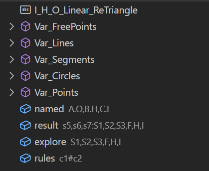
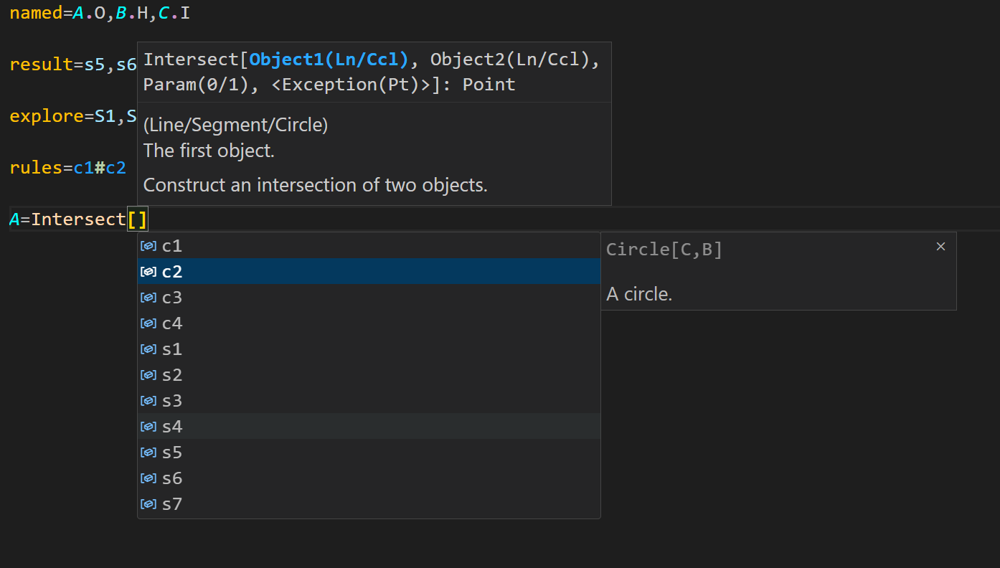
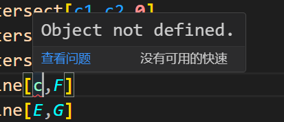
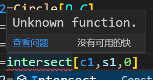
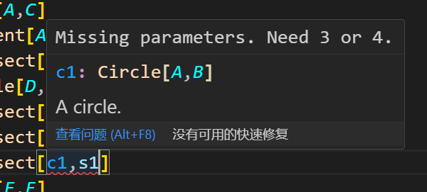
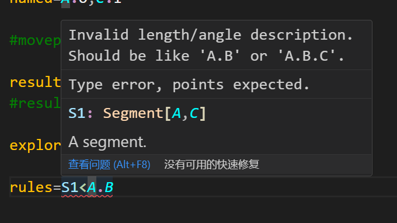

# Gmt-Extension-Pack

A multifunctional extension pack for gmt files of the game Euclidea in Visual Studio Code.

## Features

### Syntax highlighting

Display various parts of the code in different colors for easy editing and debugging:

Geometric figures(points, lines, circles, names)

Constructional functions(like 'Line' and 'Circle', basic and advanced)

Numbers(values)

Arguments(in the functions 'Intersect', 'EdgePoint' and 'Tangent')

Level setting variables(like 'initial', 'result' and 'explore')

Connecting symbols(':', '.' and '|')

Operating symbols('#', '/', '<' and '>')

Comments

---

### Automatic completion

With functions and blocks:

Constructional functions

Level settings

Variables (more accurate)

---

### Outline

List all symbols and level-settings

---

### More practical helpers

Including help window in functions' completion and variables' completion

---

### Hovering

Support hovering windows to variables and functions

Hover the cursor over the words to show

---

### Renaming

Select a renamable symbol and press F2 to rename

Automatically distinguish between variable and display names(in 'named')

---

### Diagnostics(Beta)

Support basic semantic error checking, including punctuation issues, variables and functions checks, etc.

Errors(red) and warnings(yellow)

## Usage

0. Visual Studio Code
1. Open this extension pack **(folder)** in VSCode
2. F5 to open a new VSCode window
3. Open a gmt file
4. Enjoy

---

* Also can be imported as an integral extension (Directory: users/xxx/.vscode/extensions/). Suggest packaging this extension folder as a ***vsix*** file to install.
* Apply ***Gmt Highlighting Theme*** (or overwrite the '***settings.json***' with *tmTheme* files) if syntax highlighting dosen't work normally.
